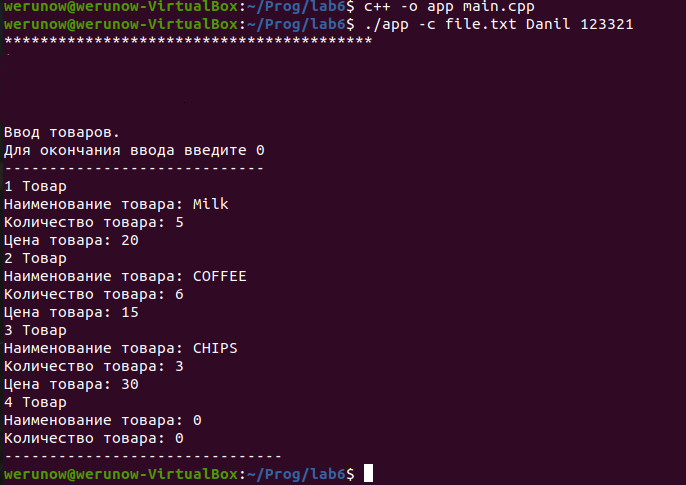
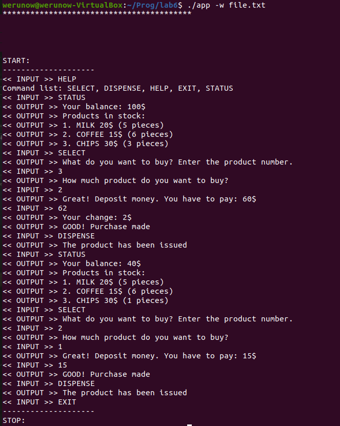
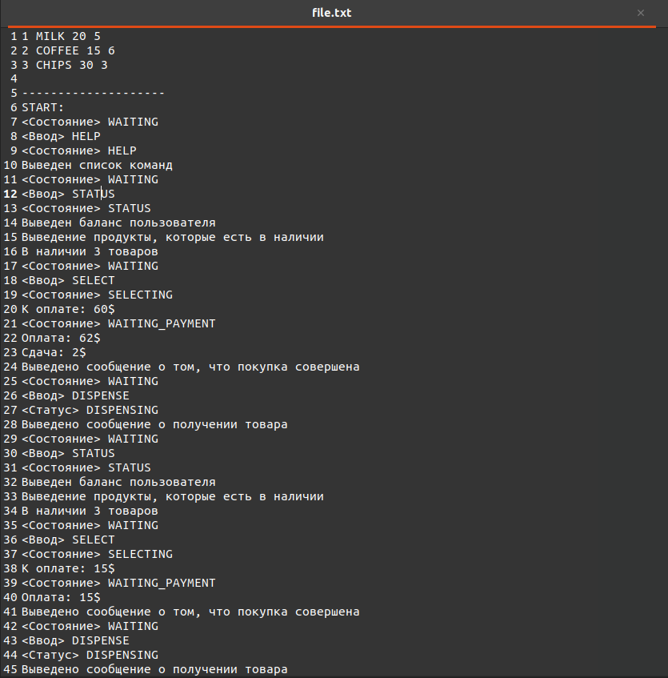

# Конечный автомат (или попросту FSM — Finite-state machine)
## Задача

> Согласно заданию разработать алгоритм работы конечного автомата, моделирующего процесс работы торгового автомата. Для представления «долговременной памяти» автомата использовать текстовый файл. Написать программу, реализующую разработанный алгоритм. 
Программа должна запускаться в двух режимах работы: 1) режим конфигурирования, позволяющий задавать параметры моделируемой системы; 2) рабочий режим, моделирующий работу конечного автомата. Режим работы программы задается при помощи аргументов командной строки.

## Запуск программы
Для запуска программы в режиме конфигурирования необходимо сначала скомпилировать:
> c++ -o <prog_name> main.cpp

А затем запустить программу в зависимости от режима работы
> ./<prog_name> -c <text_file> <user_login> <user_password> - для запуска режима конфигурирования\
> ./<prog_name> -w <text_file> - для запуска рабочего режима

## Скриншоты работы программы:

	
 Запуск файла в режиме конфигурирования

	 
	
Запуск файла в рабочем режиме

	 
	
Текстовый файл, в который сначала записываются данные посредством их ввода с помощью режима конфигурации, а после отображается вся память конечного автомат 

	

